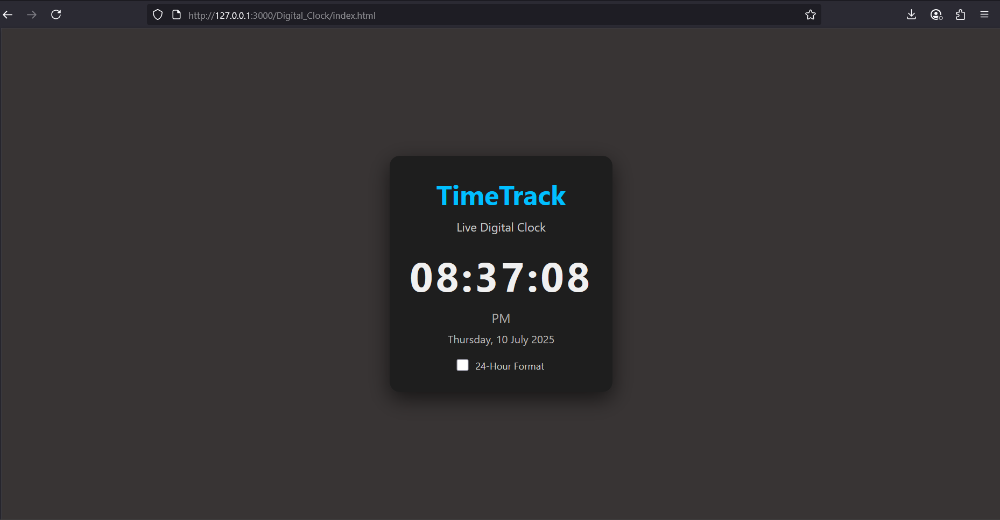

# Digital_Clock
## Date: 10-07-2025
## Objective:
To create a live digital clock using HTML, CSS, and JavaScript that updates every second and displays the current time in HH:MM:SS format — a feature commonly used in dashboards and admin panels.

## Tasks:

#### 1. Create the HTML Structure:
Use a ```<div>``` with an ID like clock to hold the time display.

Add a page title like ```<h1>TimeTrack</h1>```.

Optionally, include a subtitle like “Live Digital Clock”.

#### 2. Style the Clock with CSS:
Center the clock using flexbox or text-align: center.

Use a large font size (e.g., font-size: 48px) for the clock display.

Style with a dark background and light-colored text for contrast.

Use padding, border-radius, and box-shadow for a modern look.

#### 3. Add JavaScript Functionality:
Create a function that gets the current time using new Date().

Extract hours, minutes, and seconds from the date object.

Format them to two digits using .padStart(2, "0").

Update the inner text of the clock div every second using setInterval().

#### 4. Enhancements:
Display AM/PM next to the time.

Add the current date below the time.

Let the user choose between 12-hour and 24-hour formats.

Animate the colon (:) blinking every second.

Add a “Tweet this” button with a share link.
## HTML Code:
```html
<!DOCTYPE html>
<html lang="en">
<head>
  <meta charset="UTF-8" />
  <meta name="viewport" content="width=device-width, initial-scale=1.0"/>
  <title>TimeTrack</title>
  <link rel="stylesheet" href="styles.css" />
</head>
<body>
  <div class="container">
    <h1>TimeTrack</h1>
    <p class="subtitle">Live Digital Clock</p>

    <div id="clock" class="clock">--:--:--</div>
    <div id="ampm" class="ampm">--</div>
    <div id="date" class="date">--</div>

    <div class="toggle">
      <label>
        <input type="checkbox" id="toggleFormat" />
        24-Hour Format
      </label>
    </div>
  </div>

  <script src="scripts.js"></script>
</body>
</html>

```
## CSS Code:
```css
* {
  margin: 0;
  padding: 0;
  box-sizing: border-box;
}

body {
  background-color: #383434;
  color: #f0f0f0;
  font-family: 'Segoe UI', Tahoma, Geneva, Verdana, sans-serif;
  height: 100vh;
  display: flex;
  justify-content: center;
  align-items: center;
}

.container {
  text-align: center;
  padding: 30px;
  background: #1e1e1e;
  border-radius: 15px;
  box-shadow: 0 10px 30px rgba(0, 0, 0, 0.6);
}

h1 {
  font-size: 2.5rem;
  margin-bottom: 10px;
  color: #00bfff;
}

.subtitle {
  font-size: 1.1rem;
  margin-bottom: 20px;
  color: #ccc;
}

.clock {
  font-size: 60px;
  font-weight: bold;
  letter-spacing: 4px;
  transition: opacity 0.3s ease;
}

.clock .blink {
  opacity: 0;
}

.ampm {
  font-size: 1.2rem;
  margin-top: 10px;
  color: #aaa;
}

.date {
  font-size: 1rem;
  margin-top: 8px;
  color: #bbb;
}

.toggle {
  margin-top: 20px;
  font-size: 0.9rem;
  color: #ccc;
}

input[type="checkbox"] {
  margin-right: 8px;
  transform: scale(1.3);
  cursor: pointer;
}

```
## Javascript Code:
```javascript
const clock = document.getElementById("clock");
const ampm = document.getElementById("ampm");
const dateEl = document.getElementById("date");
const toggle = document.getElementById("toggleFormat");

let is24Hour = false;

toggle.addEventListener("change", () => {
  is24Hour = toggle.checked;
  updateClock();
});

function updateClock() {
  const now = new Date();

  let hours = now.getHours();
  const minutes = now.getMinutes().toString().padStart(2, "0");
  const seconds = now.getSeconds().toString().padStart(2, "0");

  let session = "AM";
  if (!is24Hour) {
    session = hours >= 12 ? "PM" : "AM";
    hours = hours % 12 || 12;
  }

  const hrs = hours.toString().padStart(2, "0");

  // Animate colon blinking by toggling visibility every second
  const colon = now.getSeconds() % 2 === 0 ? ":" : "<span class='blink'>:</span>";

  clock.innerHTML = `${hrs}${colon}${minutes}${colon}${seconds}`;
  ampm.innerText = is24Hour ? "" : session;

  const options = { weekday: 'long', year: 'numeric', month: 'long', day: 'numeric' };
  dateEl.innerText = now.toLocaleDateString(undefined, options);
}

setInterval(updateClock, 1000);
updateClock();

```
## Output:


## Result:
A live digital clock using HTML, CSS, and JavaScript that updates every second and displays the current time in HH:MM:SS format — a feature commonly used in dashboards and admin panels is created successfully.
